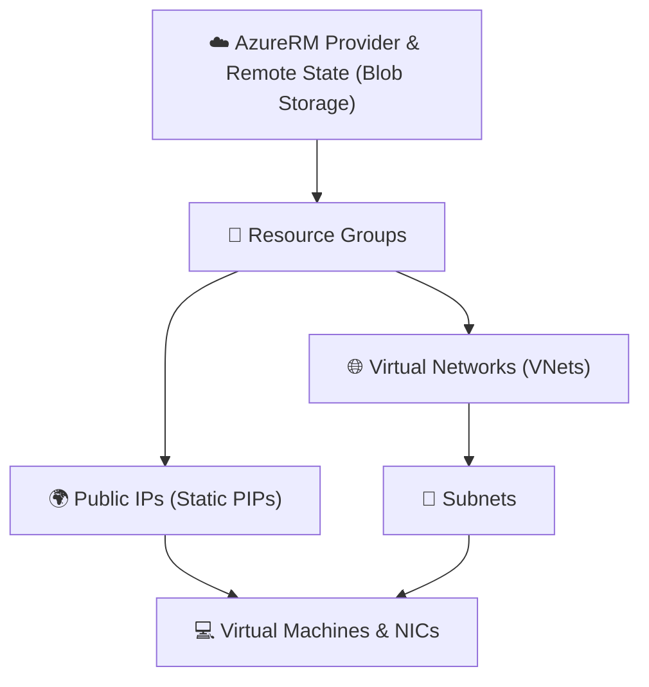

# ☁️ Azure Infrastructure Deployment with Terraform 🚀

A modular, enterprise-grade Terraform repository for provisioning and managing Microsoft Azure infrastructure components—including Resource Groups, Virtual Networks, Subnets, Public IPs, Network Interfaces, and Linux Virtual Machines. 🌐💻

---

## 📑 Table of Contents

- [🌟 Overview](#-overview)
- [🏗️ Architecture & Workflow](#️-architecture--workflow)
- [📁 Directory Structure](#-directory-structure)
- [📋 Active Infrastructure Inventory](#-active-infrastructure-inventory)
- [🧩 Module Breakdown](#-module-breakdown)
  - [📦 Child Modules](#-child-modules)
  - [🎛️ Parent Module Orchestration](#️-parent-module-orchestration)
- [⚙️ Prerequisites](#️-prerequisites)
- [🚀 Getting Started](#-getting-started)
  - [1. 🔑 Authenticate with Azure](#1--authenticate-with-azure)
  - [2. 🗄️ Configure Remote Backend](#2-️-configure-remote-backend)
  - [3. 🛠️ Initialize Terraform](#3-️-initialize-terraform)
  - [4. 🔍 Review Execution Plan](#4--review-execution-plan)
  - [5. 🚢 Apply Infrastructure](#5--apply-infrastructure)
  - [6. 🧹 Cleanup / Destroy](#6--cleanup--destroy)
- [💡 Common Troubleshooting & Tips](#-common-troubleshooting--tips)
- [📝 Configuration & Extension Reference](#-configuration--extension-reference)
- [🔒 Security Best Practices](#-security-best-practices)
- [🤝 Contributing & Support](#-contributing--support)
- [📄 License](#-license)

---

## 🌟 Overview

This repository provides an enterprise-ready, reusable infrastructure-as-code (IaC) setup using **Terraform** and the **AzureRM provider** (`~> 4.81.0`). 

✨ **Key Highlights**:
- 🧱 **Decoupled Architecture**: Modular child modules encapsulating individual Azure resource types.
- 🔁 **Dynamic Scaling**: `for_each` map-driven definitions enabling scalable, declarative resource management.
- ☁️ **Remote State Storage**: Azure Blob Storage backend configuration for state locking, team collaboration, and security.
- 🐧 **Standardized VM Deployments**: Ubuntu 22.04 LTS Gen2 Linux VMs configured with dynamic private IP allocation and dedicated public IPs.

---

## 🏗️ Architecture & Workflow

The orchestration layer handles resource creation with strict dependency ordering:



1. **📁 Resource Groups (`azurerm_resource_group`)**: Creates logical containers for Azure resources.
2. **🌐 Networking (`azurerm_virtual_network` & `azurerm_subnet`)**: Provisions isolated Virtual Networks and subnets.
3. **🌍 Public IPs (`azurerm_public_ip`)**: Allocates static public IPs for external egress/ingress.
4. **💻 Compute (`azurerm_virtual_machine`)**: Resolves subnet & PIP IDs using Terraform data sources, provisions NICs, and boots Ubuntu Linux VMs.

---

## 📁 Directory Structure

```text
📂 terraform_code_08282026/
├── 📦 child_modules/
│   ├── 🌍 azurerm_public_ip/
│   │   └── main.tf               # Generic Public IP module (for_each map)
│   ├── 📁 azurerm_resource_group/
│   │   └── main.tf               # Generic Resource Group module (for_each map)
│   ├── 🔀 azurerm_subnet/
│   │   └── main.tf               # Generic Subnet module (for_each map)
│   ├── 💻 azurerm_virtual_machine/
│   │   └── main.tf               # NICs, Data Lookups, and Linux VM resources
│   └── 🌐 azurerm_virtual_network/
│       └── main.tf               # Generic Virtual Network module (for_each map)
├── 🎛️ parent_modules/
│   ├── main.tf                   # Orchestration module declaring environment resources
│   └── provider.tf               # Provider requirements & remote Azure backend configuration
├── 🙈 .gitignore                    # Terraform state, vars, crash logs & cache exclusions
└── 📖 README.md                     # Repository documentation
```

---

## 📋 Active Infrastructure Inventory

The parent module currently configures the following environment topology:

| Category | Resource Name | Location / Target | Key Properties |
| :--- | :--- | :--- | :--- |
| 📁 **Resource Group** | `rg-nisha` | `eastus` | Base resource group |
| 📁 **Resource Group** | `rg-yashu` | `eastus` | Base resource group |
| 🌐 **Virtual Network** | `nsv7a0ntas0001c` | `eastus` (`rg-ankur`) | Address Space: `10.12.0.0/16` |
| 🌐 **Virtual Network** | `nsv7a0ntas0002c` | `eastus` (`rg-ankur`) | Address Space: `10.13.0.0/16` |
| 🔀 **Subnet** | `frontend-subnet` | `nsv7a0ntas0001c` | CIDR: `10.12.1.0/24` |
| 🔀 **Subnet** | `backend-subnet` | `nsv7a0ntas0002c` | CIDR: `10.13.1.0/24` |
| 🌍 **Public IP** | `pipnsv7` | `eastus` (`rg-ankur`) | Static IP Allocation |
| 🌍 **Public IP** | `pipnsv4` | `eastus` (`rg-ankur`) | Static IP Allocation |
| 💻 **Virtual Machine** | `frontend-vm` | `eastus` (`rg-ankur`) | Size: `Standard_DC1ds_v3`, Image: `Ubuntu 22.04 LTS` |
| 💻 **Virtual Machine** | `backend-vm` | `eastus` (`rg-ankur`) | Size: `Standard_DC1ds_v3`, Image: `Ubuntu 22.04 LTS` |

---

## 🧩 Module Breakdown

### 📦 Child Modules

| Module Directory | 📋 Description | 🔑 Key Input Schema |
| :--- | :--- | :--- |
| [`child_modules/azurerm_resource_group`](file:///d:/Git/Git/Resource_group/terraform_code_08282026/child_modules/azurerm_resource_group) | 📁 Creates Azure Resource Groups | `rgs`: `{ key = { name, location } }` |
| [`child_modules/azurerm_virtual_network`](file:///d:/Git/Git/Resource_group/terraform_code_08282026/child_modules/azurerm_virtual_network) | 🌐 Creates Virtual Networks | `vnets`: `{ key = { name, location, resource_group_name, address_space } }` |
| [`child_modules/azurerm_subnet`](file:///d:/Git/Git/Resource_group/terraform_code_08282026/child_modules/azurerm_subnet) | 🔀 Provisions Subnets inside existing VNets | `snets`: `{ key = { name, resource_group_name, virtual_network_name, address_prefixes } }` |
| [`child_modules/azurerm_public_ip`](file:///d:/Git/Git/Resource_group/terraform_code_08282026/child_modules/azurerm_public_ip) | 🌍 Allocates Azure Public IP addresses | `pip`: `{ key = { name, resource_group_name, location, allocation_method } }` |
| [`child_modules/azurerm_virtual_machine`](file:///d:/Git/Git/Resource_group/terraform_code_08282026/child_modules/azurerm_virtual_machine) | 💻 Creates NICs, data lookups, and Linux VMs | `vms`: `{ key = { nic_name, location, resource_group_name, subnet_name, virtual_network_name, pip_name, vm_name, size, admin_username, admin_password } }` |

### 🎛️ Parent Module Orchestration

Located at [`parent_modules/`](file:///d:/Git/Git/Resource_group/terraform_code_08282026/parent_modules), the parent module provides input maps to child modules and controls dependency ordering with `depends_on`:

```hcl
module "rg" {
  source = "../child_modules/azurerm_resource_group"
  rgs    = { /* ... */ }
}

module "virtual_network" {
  depends_on = [module.rg]
  source     = "../child_modules/azurerm_virtual_network"
  vnets      = { /* ... */ }
}

module "subnet" {
  depends_on = [module.virtual_network]
  source     = "../child_modules/azurerm_subnet"
  snets      = { /* ... */ }
}

module "pip" {
  depends_on = [module.rg]
  source     = "../child_modules/azurerm_public_ip"
  pip        = { /* ... */ }
}

module "vms" {
  depends_on = [module.subnet, module.pip]
  source     = "../child_modules/azurerm_virtual_machine"
  vms        = { /* ... */ }
}
```

---

## ⚙️ Prerequisites

Before executing Terraform commands, ensure the following are installed and configured:

- 🛠️ [Terraform CLI](https://developer.hashicorp.com/terraform/downloads) (>= 1.5.0 recommended)
- ☁️ [Azure CLI](https://learn.microsoft.com/en-us/cli/azure/install-azure-cli) (`az` command line tool)
- 💳 An active **Azure Subscription** with Contributor or Owner role permissions.

---

## 🚀 Getting Started

### 1. 🔑 Authenticate with Azure

Log in to your Azure account:

```bash
az login
```

Set your active target subscription:

```bash
az account set --subscription "<SUBSCRIPTION_ID_OR_NAME>"
```

Verify current identity:

```bash
az account show --output table
```

---

### 2. 🗄️ Configure Remote Backend

The root module [`parent_modules/provider.tf`](file:///d:/Git/Git/Resource_group/terraform_code_08282026/parent_modules/provider.tf) uses an Azure Blob Storage remote backend for state persistence and locking:

```hcl
terraform {
  required_providers {
    azurerm = {
      source  = "hashicorp/azurerm"
      version = "4.81.0"
    }
  }
  backend "azurerm" {
    resource_group_name  = "rg-ankurbaghel"
    storage_account_name = "chc4a0ntas0002c"
    container_name       = "ojas"
    key                  = "ojas.tfstate"
  }
}

provider "azurerm" {
  features {}
}
```

> [!NOTE]
> 💡 Ensure the target Resource Group (`rg-ankurbaghel`), Storage Account (`chc4a0ntas0002c`), and Container (`ojas`) exist in Azure before initializing.

---

### 3. 🛠️ Initialize Terraform

Navigate into `parent_modules` and run initialization:

```bash
cd parent_modules
terraform init
```

> [!TIP]
> If you update the backend storage account name, container, or resource group, always reinitialize with:
> ```bash
> terraform init -reconfigure
> ```

---

### 4. 🔍 Review Execution Plan

Validate configuration syntax and inspect proposed changes:

```bash
terraform validate
terraform plan
```

To save the plan output to an artifact for safe execution:

```bash
terraform plan -out=tfplan
```

---

### 5. 🚢 Apply Infrastructure

Deploy the resources to Microsoft Azure:

```bash
terraform apply tfplan
```

*(Or run `terraform apply` and type `yes` when prompted)*

---

### 6. 🧹 Cleanup / Destroy

To decommission and delete all managed resources:

```bash
terraform destroy
```

---

## 💡 Common Troubleshooting & Tips

| Scenario / Error | Cause | Recommended Solution |
| :--- | :--- | :--- |
| `Error: retrieving Storage Account ... unexpected status 404 (404 Not Found)` | Backend storage account name changed or old backend state is cached locally in `.terraform/` | Run `terraform init -reconfigure` to sync the new backend configuration. |
| `Error: Subnet ... was not found` | Subnet name mismatch in VM data lookup or dependency order | Ensure `virtual_network_name`, `subnet_name`, and `resource_group_name` in `module.vms` exactly match `module.subnet` and `module.virtual_network`. |
| `Error: Public IP ... was not found` | Public IP lookup name in VM module doesn't match created PIP | Verify `pip_name` in `module.vms` matches the key defined in `module.pip`. |

---

## 📝 Configuration & Extension Reference

### ➕ Adding a Resource Group

Add an entry to `rgs` in [`parent_modules/main.tf`](file:///d:/Git/Git/Resource_group/terraform_code_08282026/parent_modules/main.tf):

```hcl
rg3 = {
  name     = "rg-production"
  location = "eastus"
}
```

### ➕ Adding a Virtual Network & Subnet

```hcl
# In module "virtual_network"
vnet3 = {
  name                = "vnet-prod-eastus-001"
  location            = "eastus"
  resource_group_name = "rg-production"
  address_space       = ["10.20.0.0/16"]
}

# In module "subnet"
subnet3 = {
  name                 = "prod-app-subnet"
  resource_group_name  = "rg-production"
  virtual_network_name = "vnet-prod-eastus-001"
  address_prefixes     = ["10.20.1.0/24"]
}
```

### ➕ Adding a Virtual Machine

```hcl
# In module "vms"
vm3 = {
  nic_name             = "nic-prod-app"
  location             = "eastus"
  resource_group_name  = "rg-production"
  subnet_name          = "prod-app-subnet"
  virtual_network_name = "vnet-prod-eastus-001"
  pip_name             = "pip-prod-app"
  vm_name              = "prod-app-vm01"
  size                 = "Standard_DC1ds_v3"
  admin_username       = "azureadmin"
  admin_password       = "YourStrongPassword#123"
}
```

---

## 🔒 Security Best Practices

> [!WARNING]
> ⚠️ Never commit sensitive credentials or plain-text administrative passwords to Git repositories.

Recommended production security measures:
1. 🔑 **SSH Key Authentication**: Replace password authentication with SSH public/private key pairs (`admin_ssh_key`).
2. 🛡️ **Azure Key Vault Integration**: Store administrative secrets in Azure Key Vault and fetch them dynamically using Terraform `data "azurerm_key_vault_secret"`.
3. 🧱 **Network Security Groups (NSGs)**: Attach NSGs to subnets or NICs with least-privilege inbound rules (restricting SSH port 22 access to authorized CIDR blocks).
4. 🔐 **Remote State Hardening**: Protect the Azure Storage account holding `.tfstate` using private endpoints, Azure RBAC, and encryption in transit (`https_traffic_only_enabled = true`).

---

## 🤝 Contributing & Support

- 🐛 **Found a bug?** Open an issue or submit a pull request.
- 💡 **Need new child modules?** Create modular folders under [`child_modules/`](file:///d:/Git/Git/Resource_group/terraform_code_08282026/child_modules) following the `for_each` pattern.

---

## 📄 License

This repository is maintained for cloud infrastructure automation. Feel free to modify and adapt it for your team's deployment requirements. 🚀