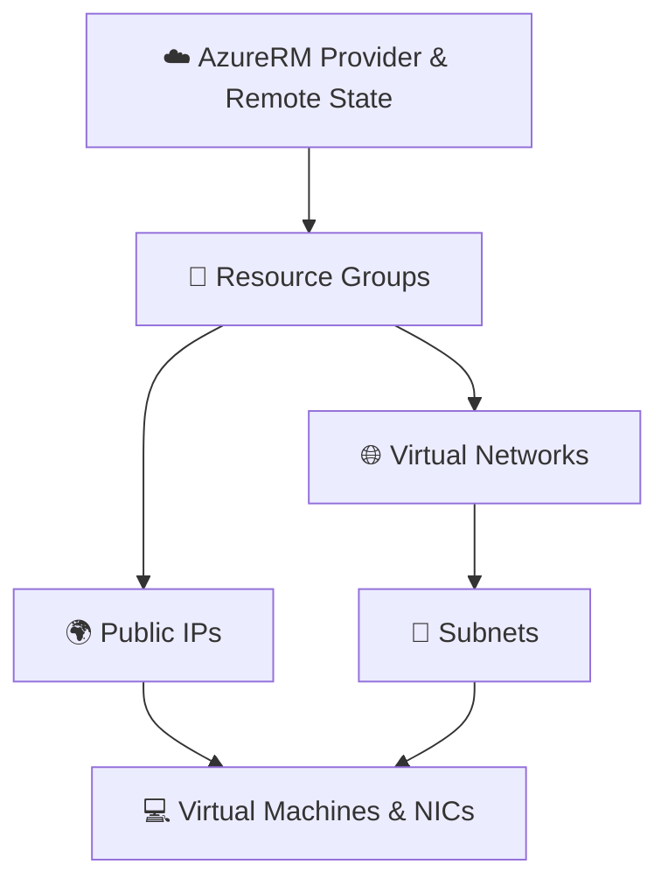

# ☁️ Azure Infrastructure Deployment with Terraform 🚀

A modular, enterprise-grade Terraform repository for provisioning and managing Microsoft Azure infrastructure components—including Resource Groups, Virtual Networks, Subnets, Public IPs, Network Interfaces, and Linux Virtual Machines. 🌐💻

---

## 📑 Table of Contents

- [🌟 Overview](#-overview)
- [🏗️ Architecture & Workflow](#️-architecture--workflow)
- [📁 Directory Structure](#-directory-structure)
- [🧩 Module Breakdown](#-module-breakdown)
  - [📦 Child Modules](#-child-modules)
  - [🎛️ Parent Module](#️-parent-module)
- [⚙️ Prerequisites](#️-prerequisites)
- [🚀 Getting Started](#-getting-started)
  - [1. 🔑 Authenticate with Azure](#1--authenticate-with-azure)
  - [2. 🗄️ Configure Remote Backend](#2-️-configure-remote-backend)
  - [3. 🛠️ Initialize Terraform](#3-️-initialize-terraform)
  - [4. 🔍 Review Execution Plan](#4--review-execution-plan)
  - [5. 🚢 Apply Infrastructure](#5--apply-infrastructure)
  - [6. 🧹 Cleanup / Destroy](#6--cleanup--destroy)
- [📝 Configuration Reference](#-configuration-reference)
- [🔒 Security Best Practices](#-security-best-practices)
- [🤝 Contributing & Support](#-contributing--support)
- [📄 License](#-license)

---

## 🌟 Overview

This repository provides an enterprise-ready, reusable infrastructure-as-code (IaC) setup using **Terraform** and the **AzureRM provider** (`~> 4.81.0`). 

✨ **Highlights**:
- 🧱 **Decoupled Architecture**: Generic, reusable child modules for individual cloud primitives.
- 🔁 **Dynamic Scaling**: `for_each` map-driven configuration for bulk resource creation.
- ☁️ **Remote State Management**: Azure Blob Storage backend for team collaboration and state locking.
- 🐧 **Standardized OS Images**: Automated deployment of Ubuntu 22.04 LTS Gen2 virtual machines.

---

## 🏗️ Architecture & Workflow

The orchestration layer provisions cloud resources in sequential, dependency-aware stages:



1. **📁 Resource Groups (`azurerm_resource_group`)**: Establishes administrative container boundaries for Azure resources.
2. **🌐 Networking (`azurerm_virtual_network` & `azurerm_subnet`)**: Creates custom VNets with CIDR address spaces and network subnets.
3. **🌍 Public IPs (`azurerm_public_ip`)**: Allocates static IP addresses for external connectivity.
4. **💻 Compute (`azurerm_virtual_machine`)**: Creates Network Interfaces (NICs) bound to subnets & public IPs via dynamic data lookups, and launches Ubuntu Linux 22.04 LTS VMs.

---

## 📁 Directory Structure

```text
📂 terraform_code_08282026/
├── 📦 child_modules/
│   ├── 🌍 azurerm_public_ip/
│   │   └── main.tf               # Generic Public IP module (for_each)
│   ├── 📁 azurerm_resource_group/
│   │   └── main.tf               # Generic Resource Group module (for_each)
│   ├── 🔀 azurerm_subnet/
│   │   └── main.tf               # Generic Subnet module (for_each)
│   ├── 💻 azurerm_virtual_machine/
│   │   └── main.tf               # NICs, Data Lookups, and Linux VM resources
│   └── 🌐 azurerm_virtual_network/
│       └── main.tf               # Generic Virtual Network module (for_each)
├── 🎛️ parent_modules/
│   ├── main.tf                   # Orchestration module declaring environment resources
│   └── provider.tf               # Provider requirements and remote Azure backend configuration
├── 🙈 .gitignore                    # Terraform state, vars, and lockfile exclusions
└── 📖 README.md                     # Repository documentation
```

---

## 🧩 Module Breakdown

### 📦 Child Modules

| Module Directory | 📋 Description | 🔑 Key Inputs |
| :--- | :--- | :--- |
| `child_modules/azurerm_resource_group` | 📁 Creates Azure Resource Groups | `rgs` (map of `name` and `location`) |
| `child_modules/azurerm_virtual_network` | 🌐 Creates Virtual Networks | `vnets` (map of `name`, `location`, `resource_group_name`, `address_space`) |
| `child_modules/azurerm_subnet` | 🔀 Provisions Subnets inside existing VNets | `snets` (map of `name`, `resource_group_name`, `virtual_network_name`, `address_prefixes`) |
| `child_modules/azurerm_public_ip` | 🌍 Allocates Azure Public IP addresses | `pip` (map of `name`, `resource_group_name`, `location`, `allocation_method`) |
| `child_modules/azurerm_virtual_machine` | 💻 Creates NICs, fetches subnet/PIP data, and deploys Linux VMs | `vms` (map containing VM specs, credentials, NIC, VNet, subnet, and PIP details) |

### 🎛️ Parent Module

Located at [`parent_modules/`](file:///d:/Git/Git/Resource_group/terraform_code_08282026/parent_modules), the parent module coordinates inputs to child modules and controls execution dependencies using `depends_on`:

- 📁 **Resource Groups**: Configured in `module.rg`
- 🌐 **Virtual Networks**: Configured in `module.virtual_network`
- 🔀 **Subnets**: Configured in `module.subnet`
- 🌍 **Public IPs**: Configured in `module.pip`
- 💻 **Virtual Machines**: Configured in `module.vms`

---

## ⚙️ Prerequisites

Before running Terraform, ensure you have the following installed and configured:

- 🛠️ [Terraform CLI](https://developer.hashicorp.com/terraform/downloads) (>= 1.5.0 recommended)
- ☁️ [Azure CLI](https://learn.microsoft.com/en-us/cli/azure/install-azure-cli) (`az` command line tool)
- 💳 An active **Azure Subscription** with sufficient Contributor / Owner permissions.

---

## 🚀 Getting Started

### 1. 🔑 Authenticate with Azure

Log in to your Azure account using the Azure CLI:

```bash
az login
```

If you have multiple subscriptions, set your target subscription:

```bash
az account set --subscription "<SUBSCRIPTION_ID_OR_NAME>"
```

### 2. 🗄️ Configure Remote Backend

The root module [`parent_modules/provider.tf`](file:///d:/Git/Git/Resource_group/terraform_code_08282026/parent_modules/provider.tf) is configured with an Azure Blob Storage backend:

```hcl
terraform {
  required_providers {
    azurerm = {
      source  = "hashicorp/azurerm"
      version = "4.81.0"
    }
  }
  backend "azurerm" {
    resource_group_name  = "rg-ankurbaghel"
    storage_account_name = "chc4a0ntas0001c"
    container_name       = "ojas"
    key                  = "ojas.tfstate"
  }
}
```

> [!NOTE]
> 💡 Ensure the target Resource Group, Storage Account, and Blob Container exist before initialization, or update the backend block to match your environment.

### 3. 🛠️ Initialize Terraform

Navigate to the `parent_modules` directory and initialize the working directory:

```bash
cd parent_modules
terraform init
```

### 4. 🔍 Review Execution Plan

Generate an execution plan to preview infrastructure changes before deployment:

```bash
terraform plan
```

### 5. 🚢 Apply Infrastructure

Deploy the resources to Azure:

```bash
terraform apply
```

Type `yes` when prompted to confirm the deployment.

### 6. 🧹 Cleanup / Destroy

To tear down and remove all resources created by this Terraform configuration:

```bash
terraform destroy
```

---

## 📝 Configuration Reference

### ➕ Adding a New Virtual Machine

To provision an additional VM, add an entry to the `vms` map in [`parent_modules/main.tf`](file:///d:/Git/Git/Resource_group/terraform_code_08282026/parent_modules/main.tf):

```hcl
vm3 = {
  nic_name             = "nic-database"
  location             = "eastus"
  resource_group_name  = "rg-ankur"
  subnet_name          = "backend-subnet"
  virtual_network_name = "nsv7a0ntas0002c"
  pip_name             = "pipnsv4"
  vm_name              = "db-vm"
  size                 = "Standard_DC1ds_v3"
  admin_username       = "adminuser"
  admin_password       = "YourStrongPassword#123"
}
```

---

## 🔒 Security Best Practices

> [!WARNING]
> ⚠️ Do not store plain-text administrative passwords in version-controlled files (`main.tf`).

Recommended security practices:
1. 🔑 **Use SSH Keys or Secrets Management**: Use SSH key pairs (`admin_ssh_key`) or Azure Key Vault for managing virtual machine credentials.
2. 🛡️ **Externalize Variables**: Use `variables.tf` and pass values via secure environment variables (`TF_VAR_...`) or CI/CD pipeline secrets (GitHub Actions, Azure DevOps).
3. 🧱 **Network Security Groups (NSGs)**: Ensure subnets or network interfaces have NSGs configured to restrict inbound and outbound traffic.
4. 🔐 **State Protection**: Secure the Azure Storage account holding `.tfstate` with private endpoints, role-based access control (RBAC), and encryption at rest.

---

## 🤝 Contributing & Support

- 🐛 **Found a bug?** Open an issue in the repository.
- 💡 **Have a feature request?** Submit a pull request or start a discussion.

---

## 📄 License

This repository is maintained for cloud infrastructure automation. Feel free to modify and adapt it for your team's deployment requirements. 🚀